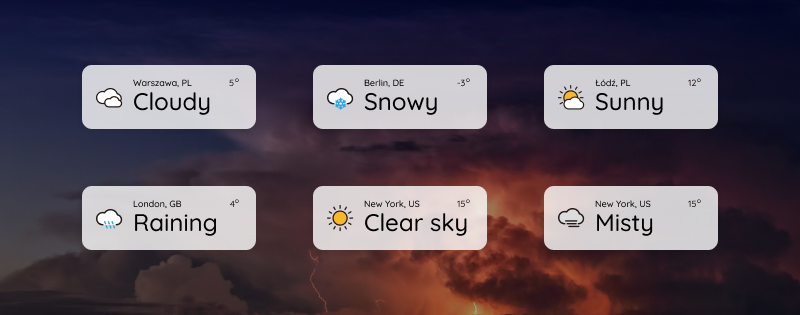

# Weather Widget

Simple weather widget for your website based on [OpenWeatherMap.org](https://openweathermap.org/api). You can controll where the widget is placed by using _CSS_ selectors.

## How works
This widget connects to OpenWeatherMap API and get data about current weather in one of 5 cities. The data is refreshed every 10 seconds and city changes every 1 minute.

## Custom placement
To change placement of weather widget just add one or more _CSS_ class to _weather-widget_ element
- ```bottom```: 10% from bottom
- ```top```: 10% from top
- ```right```: 5% from right side
- ```left```: 5% from left side

## How to use
Put this tag into your HTML code, just after body
```html
<a class="weather-widget" target="_blank"></a>
```
And import this
```html
<link rel="stylesheet" href="assets/css/main.css">
<script src="assets/css/main.js"></script>
```
Remember to add your API Key into JavaScript file.

## Development
Just clone repo and install _devDependencies_ and if you want to modify stylesheets just run ```npm run sass``` to enable compiling scss files to css

## License
Basically, you can do whatever you want as long as you include the original copyright and license notice in any copy of the software/source. [Simple overview of license](https://tldrlegal.com/license/mit-license)
